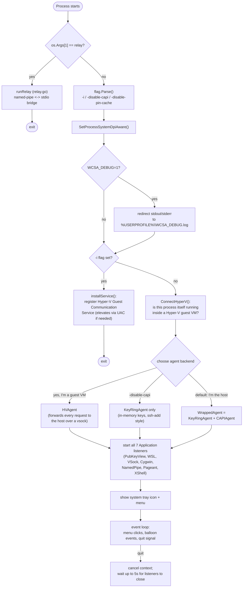
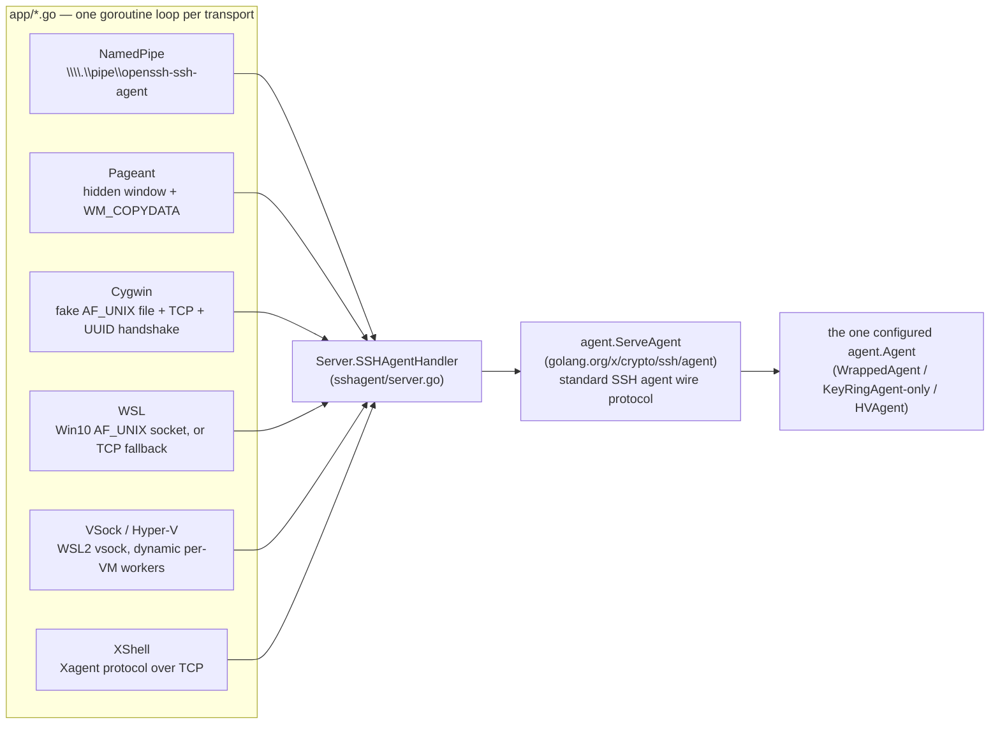
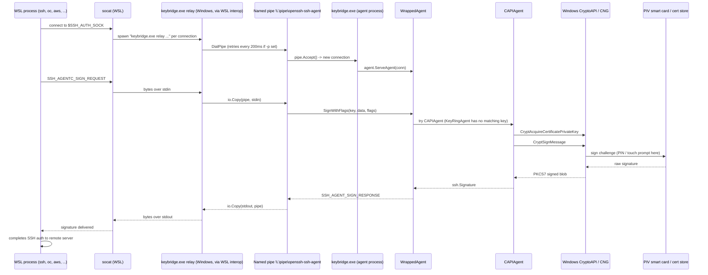
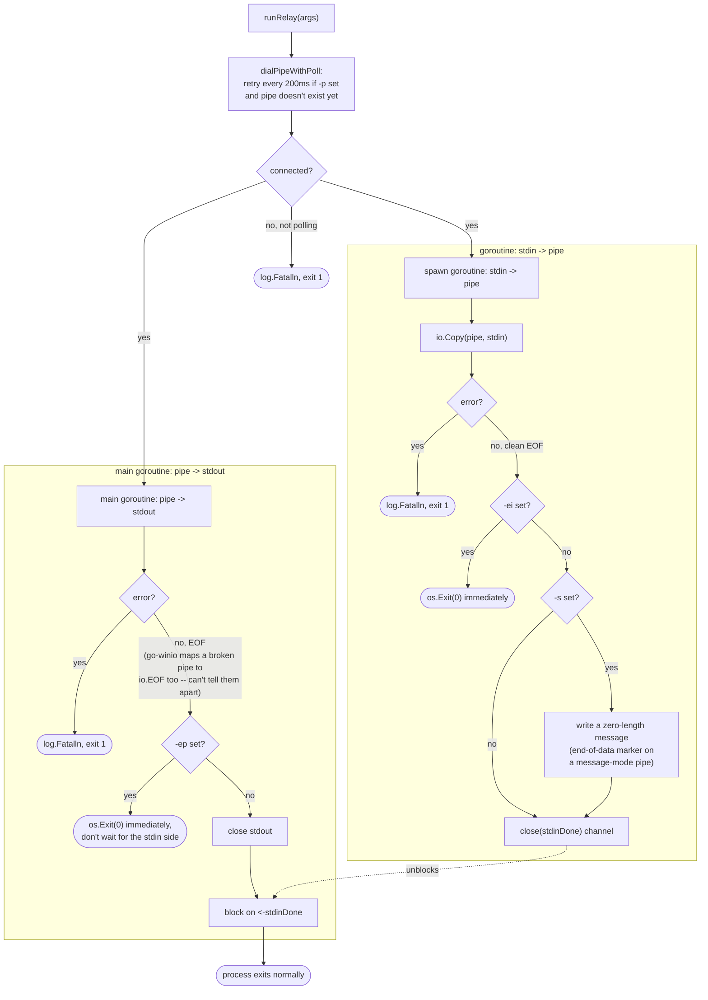
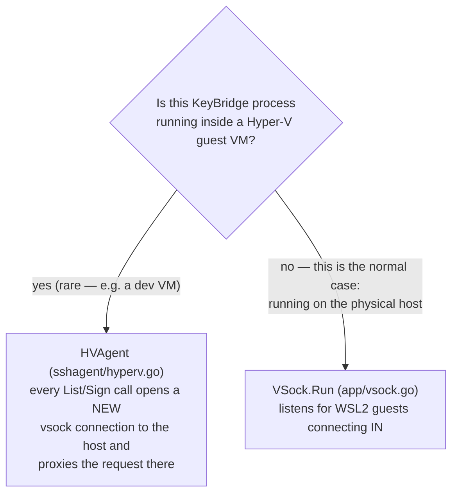
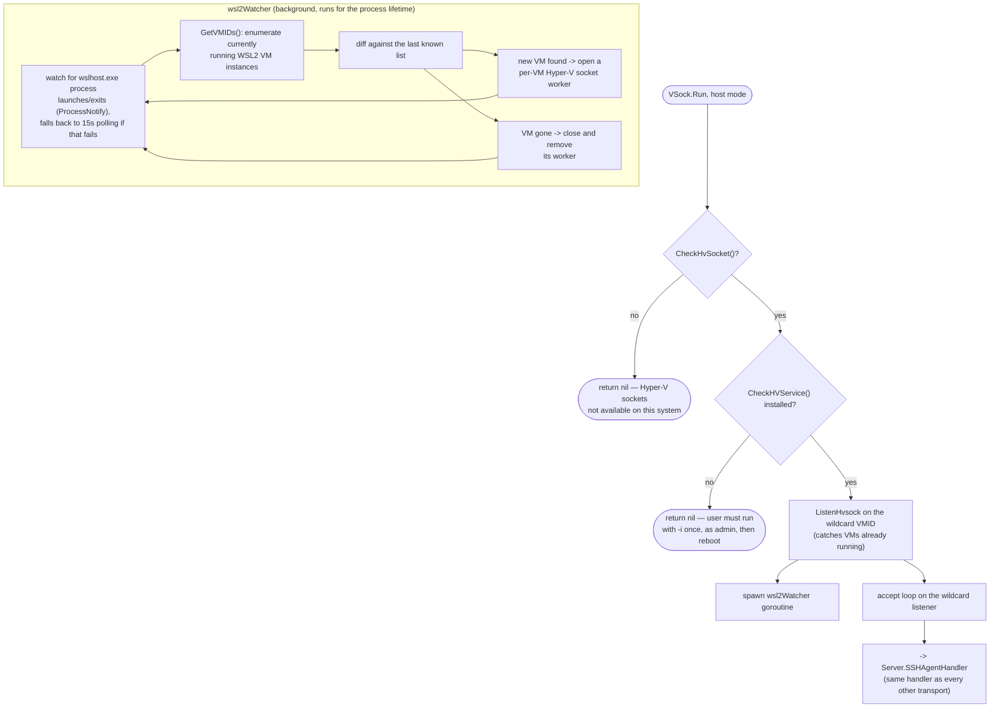
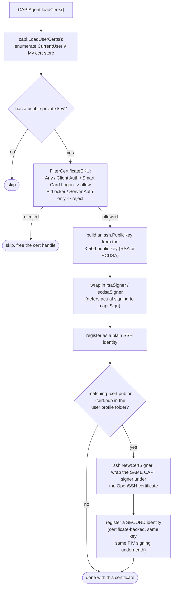

# KeyBridge — Application Flows

This document maps every code path in KeyBridge: how the process decides what to run at startup, how each of the seven transports feeds into the same SSH-agent core, how a sign request actually reaches the smart card and comes back, and how the new relay subcommand behaves internally. It's meant to be read alongside the source, not instead of it — each diagram names the actual file/function it corresponds to.

## 1. Startup and mode selection

Everything starts in `main()`. The very first check — added for KeyBridge — decides whether this run is the relay tool or the SSH agent; everything below it is unmodified upstream behavior.

**Two things worth calling out:**
- The `-i` install path and the relay path both exit before the tray/agent ever starts — they're one-shot operations, not the normal running mode.
- "Is this process a Hyper-V guest" and "is this process serving Hyper-V guests" are *opposite roles* using the *same* socket mechanism — see §5.

## 2. How the six network transports share one agent core

KeyBridge speaks six different wire protocols (five upstream, all unchanged), but every one of them ends up calling the exact same handler. This is why the relay addition was safe to make: it only had to reach the *NamedPipe* transport's existing pipe, not reimplement anything about how requests are served.

`PubKeyView` (the "Show Public Keys" tray menu item) isn't shown above — it doesn't listen on anything, it just holds a reference to the agent for the menu's `List()` call.

## 3. A sign request, end to end (the flagship path)

This is the flow that matters most: a WSL process asking to sign an SSH auth challenge, and the request actually reaching the PIV card. Every hop after "Relay" is completely unmodified upstream code — the relay only had to get bytes to the pipe.

If `WrappedAgent` had a matching key in `KeyRingAgent` instead (a plain key added via `ssh-add`), the CryptoAPI/PIV hop is skipped entirely — `WrappedAgent.SignWithFlags` tries each wrapped agent in order and returns on the first success.

## 4. Relay mode internals (`relay.go`)

Two things run concurrently: the goroutine copying stdin into the pipe, and the main goroutine copying the pipe to stdout. The four flags (`-p`, `-s`, `-ep`, `-ei`) all just change exit/wait behavior around the edges of this shape.

The go-winio note in `E1` is the one meaningful behavioral difference from upstream npiperelay (documented in the source comment too): npiperelay's raw Win32 calls can distinguish "the remote signaled a clean end-of-data" from "the pipe actually broke," and exits immediately without waiting on stdin for the latter. go-winio surfaces both as plain `io.EOF`, so KeyBridge can't make that distinction here — it always waits on the stdin side to finish on its own instead (or exits immediately if `-ep` is set, same as before).

## 5. WSL2 / Hyper-V vsock — two opposite roles, one mechanism

This is the part of the codebase most likely to be misread, because the same `winio.ListenHvsock` / vsock machinery is used for two different roles depending on which side of the VM boundary this process is running on.

KeyBridge's relay mode is an alternative to this whole mechanism for reaching WSL, not a replacement for it — the vsock path needs a one-time elevated install (`-i`) and a reboot; the relay path only needs `socat` and no elevation at all. Which one is actually in use is a per-environment choice.

## 6. Loading identities: cert store, EKU filtering, and OpenSSH certificate pairing

This runs once per `List()` call (`CAPIAgent.loadCerts()`), which happens on every `SSH_AGENTC_REQUEST_IDENTITIES` — so certificate changes (a new smart card inserted, a cert renewed) are picked up live, no restart needed.

## 7. Quick reference: which flow applies when

| Scenario | Diagram | Notes |
|---|---|---|
| `keybridge.exe relay //./pipe/...` invoked from WSL | §4, then §3 from "Pipe" onward | The normal KeyBridge-from-WSL path |
| Native Windows SSH client (PuTTY, Git for Windows, JetBrains) | §3, starting from whichever transport it uses instead of the relay | Same agent core, different transport |
| First-time smart card setup / renewed certificate | §6 | Runs automatically on the next `List()`, no restart |
| `-i` flag | §1 (Install path) | One-shot, elevates, requires reboot to take effect |
| Running inside a Hyper-V dev VM | §5, `HVAgent` branch | Uncommon; most users are the host, not a guest |
| WSL2 via the built-in vsock mechanism (not the relay) | §5, `VSock.Run` branch | Alternative to the relay; needs `-i` + reboot once |
| `-disable-capi` | §1, `KeyRingOnly` branch | No smart card access at all — plain `ssh-add` keys only |
